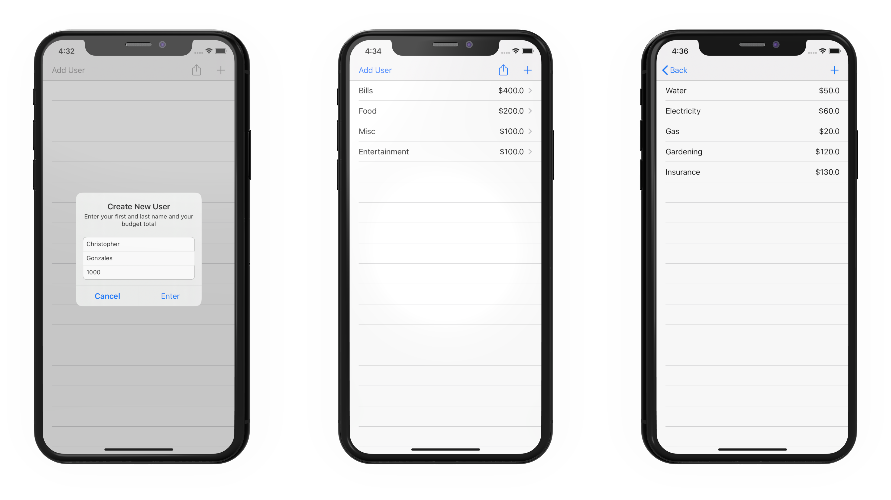

# Financify

  

Financify is a personal finance app to help you keep track of your spending and earnings. It’s perfect for sharing a budget with a spouse, family member, or even just a friend. Your information will be kept up to date with iCloud Syncing so no dollar goes left untracked.

# Onboarding
We get it, you want to get into the app as fast as possible, and we want to get you using the app as fast as possible. That's why we created a brief intro to the app to help you get started.

 

# Walkthrough
We created a quick walkthrough of how to use the app to take the guess work out. It's really fast and really simple.
First click on the top left button to "Create a new user". Afterwards click on "add" button on the top right to create a new budget. After it appears, tap on it. You'll be greeted with a sharing screen, if you don't wish to share just close out of it. Then you can press on the "add" button on the top right to create a new item. That's it. 
 

# Features
* Create Various Categories
* Set yourself a unique budget for each category you create
* Each expense you add will automatically be deducted from the budget you created
* iCloud sharing allows multiple people to edit the budget

# Additional Screenshots
 

# Authors
* Christopher Gonzales
* Enrique Gongora
